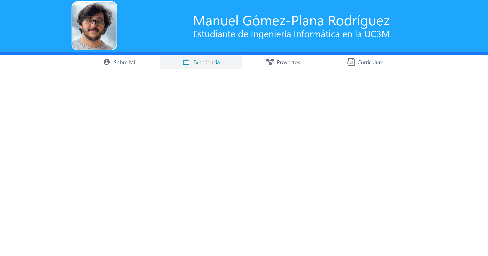

# Curriculum web using React, Vite and Typescript

Basic curriculum web made for learning React and Vite framework, using Tailwind for quick styling and TS as the main language.

## Author and contact
Manuel Gómez-Plana Rodríguez

- [Github](https://github.com/ManuGPR)
- [Linkeding](www.linkedin.com/in/manuelgpr)
## Building the web

To run the project, use the following commands:

```bash
npm install
npm run dev
```

Then, open the link to the localhost page.

## Preview

Just some quick snapshots of the page:

